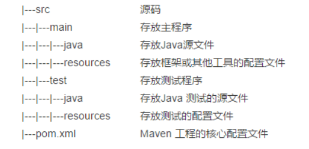

# Maven


## 工程目录
---



## 项目坐标
---
根据 groupId、artifactId、version 组合成 groupId:artifactId:version 来唯一识别一个 jar 包。

一个完整的坐标信息，由 groupId、artifactId、version、packaging、classifier 组成。

举例：
```
<groupId></groupId>
<artifactId></artifactId>
<version></version>
<packaging></packaging>
```

| 元素 | 说明 | 
| :-----:| :----: | 
| groupId | 当前maven项目所属的实际项目(必须) |
| artifactId | 定义实际项目中的一个maven项目，或模块。通常以groupId为前缀(必须) | 
| version | 版本(必须)| 
|packaging|定义Maven项目打包的方式(可选)|


### 属性
---

```
<properties>
    <project.build.sourceEncoding>UTF-8</project.build.sourceEncoding>
</properties>
```
Maven 中一共有六类属性。

#### 内置属性
＄{basedir}表示项目的根目录，也就是包含 pom.xml 文件的目录；
＄{version}表示项目的版本。


#### pom属性
＄{project.build.sourceDirectory}：项目的主源码目录，默认是 src/main/java。
＄{project.build.testSourceDirectory}：项目的测试源码目录，默认是 src/test/java。
＄{project.build.directory}：项目构建输出目录，默认是 target。
＄{project.outputDirectory}：项目主代码编译输出目录，默认是 target/classes。
＄{project.testOutputDirectory}：项目测试代码编译输出目录，默认是 target/testclasses。
＄{project.groupId}：项目的 groupId。
＄{project.artifactId}：项目的 artifactId。
＄{project.version}：项目的版本。
＄{project.build.finalName}：项目输出的文件名称，默认为“＄{project.artifactId}-＄{project.version}”。


#### 自定义属性
用户可以在 pom 的 properties 中定义自己的 Maven 属性，然后在后面重复使用

#### Settings 属性
Settings 属性同 POM 属性是一样的，可以用以“settings.”开头的属性
引用 settings.xml 文件中 XML 元素的值。
如使用“＄{settings.localRepository}”指向用户本地仓库的地址。

#### Java 系统属性
所有的 Java 系统属性都可以通过 Maven 属性引用，比如“＄{user.home}”指向的就是用户目录。用户可以通过使用“mvn help:system”命令查看所有的 Java 系统属性

####  环境变量属性
所有的环境变量都可以用以“evn.”开头的 Maven 属性引用。比如，“＄{evn.JAVA_HOME}”就指向引用了 JAVA_HOME 环境变量的值。同查看 Java 系统属性一样，用户可以使用命令“mvn help:system”查看到所有的环境变量。

## 命令
```
mvn [plugin-name]:[goal-name]

```
用户可以通过两种方式调用Maven插件的目标：

1、将插件目标与生命周期阶段lifecycle phase绑定，这样用户在命令行只是输入生命周期阶段而已，例如Maven默认将maven-compiler-plugin的compile目标与compile生命周期阶段绑定，因此命令mvn compile实际上是先定位到compile这一生命周期阶段，然后再根据绑定关系调用maven-compiler-plugin的compile目标。


2、直接在命令行指定要执行的插件目标，例如mvnarchetype:generate就表示调用maven-archetype-plugin的generate目标，这种带冒号的调用方式与生命周期无关


