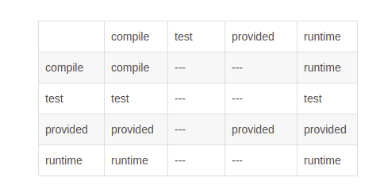
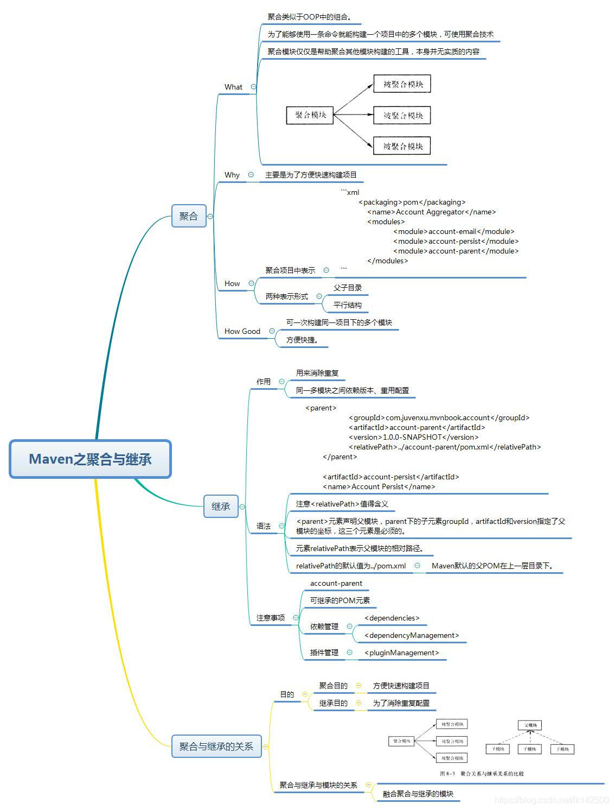

# Maven


## 工程目录


## 配置


## POM 文件
```
<project xmlns="http://maven.apache.org/POM/4.0.0" xmlns:xsi="http://www.w3.org/2001/XMLSchema-instance"
    xsi:schemaLocation="http://maven.apache.org/POM/4.0.0http://maven.apache.org/maven-v4_0_0.xsd">


    
    <!--父项目的坐标。如果项目中没有规定某个元素的值，那么父项目中的对应值即为项目的默认值。 坐标包括group ID，artifact ID和 version。 -->
    <parent>
        <!--被继承的父项目的构件标识符 -->
        <artifactId />
        <!--被继承的父项目的全球唯一标识符 -->
        <groupId />
        <!--被继承的父项目的版本 -->
        <version />
        <!-- 父项目的pom.xml文件的相对路径。相对路径允许你选择一个不同的路径。默认值是../pom.xml。Maven首先在构建当前项目的地方寻找父项 
            目的pom，其次在文件系统的这个位置（relativePath位置），然后在本地仓库，最后在远程仓库寻找父项目的pom。 -->
        <relativePath />
    </parent>


    <!--声明项目描述符遵循哪一个POM模型版本。模型本身的版本很少改变，虽然如此，但它仍然是必不可少的，这是为了当Maven引入了新的特性或者其他模型变更的时候，确保稳定性。 -->
    <modelVersion>4.0.0</modelVersion>


    <!--项目的全球唯一标识符，通常使用全限定的包名区分该项目和其他项目。并且构建时生成的路径也是由此生成， 如com.mycompany.app生成的相对路径为：/com/mycompany/app -->
    <groupId>asia.banseon</groupId>


    <!-- 构件的标识符，它和group ID一起唯一标识一个构件。换句话说，你不能有两个不同的项目拥有同样的artifact ID和groupID；在某个 特定的group ID下，artifact ID也必须是唯一的。构件是项目产生的或使用的一个东西，Maven为项目产生的构件包括：JARs，源 码，二进制发布和WARs等。 -->
    <artifactId>banseon-maven2</artifactId>


    <!--项目产生的构件类型，例如jar、war、ear、pom。插件可以创建他们自己的构件类型，所以前面列的不是全部构件类型 -->
    <packaging>jar</packaging>


    <!--项目当前版本，格式为:主版本.次版本.增量版本-限定版本号 -->
    <version>1.0-SNAPSHOT</version>


    <!--项目的名称, Maven产生的文档用 -->
    <name>banseon-maven</name>


    <!--项目主页的URL, Maven产生的文档用 -->
    <url>http://www.baidu.com/banseon</url>


    <!-- 项目的详细描述, Maven 产生的文档用。 当这个元素能够用HTML格式描述时（例如，CDATA中的文本会被解析器忽略，就可以包含HTML标 
        签）， 不鼓励使用纯文本描述。如果你需要修改产生的web站点的索引页面，你应该修改你自己的索引页文件，而不是调整这里的文档。 -->
    <description>A maven project to study maven.</description>


    <!--描述了这个项目构建环境中的前提条件。 -->
    <prerequisites>
        <!--构建该项目或使用该插件所需要的Maven的最低版本 -->
        <maven />
    </prerequisites>


    <!--项目的问题管理系统(Bugzilla, Jira, Scarab,或任何你喜欢的问题管理系统)的名称和URL，本例为 jira -->
    <issueManagement>
        <!--问题管理系统（例如jira）的名字， -->
        <system>jira</system>
        <!--该项目使用的问题管理系统的URL -->
        <url>http://jira.baidu.com/banseon</url>
    </issueManagement>


    <!--项目持续集成信息 -->
    <ciManagement>
        <!--持续集成系统的名字，例如continuum -->
        <system />
        <!--该项目使用的持续集成系统的URL（如果持续集成系统有web接口的话）。 -->
        <url />
        <!--构建完成时，需要通知的开发者/用户的配置项。包括被通知者信息和通知条件（错误，失败，成功，警告） -->
        <notifiers>
            <!--配置一种方式，当构建中断时，以该方式通知用户/开发者 -->
            <notifier>
                <!--传送通知的途径 -->
                <type />
                <!--发生错误时是否通知 -->
                <sendOnError />
                <!--构建失败时是否通知 -->
                <sendOnFailure />
                <!--构建成功时是否通知 -->
                <sendOnSuccess />
                <!--发生警告时是否通知 -->
                <sendOnWarning />
                <!--不赞成使用。通知发送到哪里 -->
                <address />
                <!--扩展配置项 -->
                <configuration />
            </notifier>
        </notifiers>
    </ciManagement>


    <!--项目创建年份，4位数字。当产生版权信息时需要使用这个值。 -->
    <inceptionYear />


    <!--项目相关邮件列表信息 -->
    <mailingLists>
        <!--该元素描述了项目相关的所有邮件列表。自动产生的网站引用这些信息。 -->
        <mailingList>
            <!--邮件的名称 -->
            <name>Demo</name>
            <!--发送邮件的地址或链接，如果是邮件地址，创建文档时，mailto: 链接会被自动创建 -->
            <post>banseon@126.com</post>
            <!--订阅邮件的地址或链接，如果是邮件地址，创建文档时，mailto: 链接会被自动创建 -->
            <subscribe>banseon@126.com</subscribe>
            <!--取消订阅邮件的地址或链接，如果是邮件地址，创建文档时，mailto: 链接会被自动创建 -->
            <unsubscribe>banseon@126.com</unsubscribe>
            <!--你可以浏览邮件信息的URL -->
            <archive>http:/hi.baidu.com/banseon/demo/dev/</archive>
        </mailingList>
    </mailingLists>


    <!--项目开发者列表 -->
    <developers>
        <!--某个项目开发者的信息 -->
        <developer>
            <!--SCM里项目开发者的唯一标识符 -->
            <id>HELLO WORLD</id>
            <!--项目开发者的全名 -->
            <name>banseon</name>
            <!--项目开发者的email -->
            <email>banseon@126.com</email>
            <!--项目开发者的主页的URL -->
            <url />
            <!--项目开发者在项目中扮演的角色，角色元素描述了各种角色 -->
            <roles>
                <role>Project Manager</role>
                <role>Architect</role>
            </roles>
            <!--项目开发者所属组织 -->
            <organization>demo</organization>
            <!--项目开发者所属组织的URL -->
            <organizationUrl>http://hi.baidu.com/banseon</organizationUrl>
            <!--项目开发者属性，如即时消息如何处理等 -->
            <properties>
                <dept>No</dept>
            </properties>
            <!--项目开发者所在时区， -11到12范围内的整数。 -->
            <timezone>-5</timezone>
        </developer>
    </developers>


    <!--项目的其他贡献者列表 -->
    <contributors>
        <!--项目的其他贡献者。参见developers/developer元素 -->
        <contributor>
            <name />
            <email />
            <url />
            <organization />
            <organizationUrl />
            <roles />
            <timezone />
            <properties />
        </contributor>
    </contributors>


    <!--该元素描述了项目所有License列表。 应该只列出该项目的license列表，不要列出依赖项目的 license列表。如果列出多个license，用户可以选择它们中的一个而不是接受所有license。 -->
    <licenses>
        <!--描述了项目的license，用于生成项目的web站点的license页面，其他一些报表和validation也会用到该元素。 -->
        <license>
            <!--license用于法律上的名称 -->
            <name>Apache 2</name>
            <!--官方的license正文页面的URL -->
            <url>http://www.baidu.com/banseon/LICENSE-2.0.txt</url>
            <!--项目分发的主要方式： repo，可以从Maven库下载 manual， 用户必须手动下载和安装依赖 -->
            <distribution>repo</distribution>
            <!--关于license的补充信息 -->
            <comments>A business-friendly OSS license</comments>
        </license>
    </licenses>
    <!--SCM(Source Control Management)标签允许你配置你的代码库，供Maven web站点和其它插件使用。 -->
    <scm>
        <!--SCM的URL,该URL描述了版本库和如何连接到版本库。欲知详情，请看SCMs提供的URL格式和列表。该连接只读。 -->
        <connection>
            scm:svn:http://svn.baidu.com/banseon/maven/banseon/banseon-maven2-trunk(dao-trunk)
        </connection>
        <!--给开发者使用的，类似connection元素。即该连接不仅仅只读 -->
        <developerConnection>
            scm:svn:http://svn.baidu.com/banseon/maven/banseon/dao-trunk
        </developerConnection>
        <!--当前代码的标签，在开发阶段默认为HEAD -->
        <tag />
        <!--指向项目的可浏览SCM库（例如ViewVC或者Fisheye）的URL。 -->
        <url>http://svn.baidu.com/banseon</url>
    </scm>
    <!--描述项目所属组织的各种属性。Maven产生的文档用 -->
    <organization>
        <!--组织的全名 -->
        <name>demo</name>
        <!--组织主页的URL -->
        <url>http://www.baidu.com/banseon</url>
    </organization>


    <!--构建项目需要的信息 -->
    <build>
        <!--该元素设置了项目源码目录，当构建项目的时候，构建系统会编译目录里的源码。该路径是相对于pom.xml的相对路径。 -->
        <sourceDirectory />


        <!--该元素设置了项目脚本源码目录，该目录和源码目录不同：绝大多数情况下，该目录下的内容 会被拷贝到输出目录(因为脚本是被解释的，而不是被编译的)。 -->
        <scriptSourceDirectory />


        <!--该元素设置了项目单元测试使用的源码目录，当测试项目的时候，构建系统会编译目录里的源码。该路径是相对于pom.xml的相对路径。 -->
        <testSourceDirectory />


        <!--被编译过的应用程序class文件存放的目录。 -->
        <outputDirectory />


        <!--被编译过的测试class文件存放的目录。 -->
        <testOutputDirectory />


        <!--使用来自该项目的一系列构建扩展 -->
        <extensions>
            <!--描述使用到的构建扩展。 -->
            <extension>
                <!--构建扩展的groupId -->
                <groupId />
                <!--构建扩展的artifactId -->
                <artifactId />
                <!--构建扩展的版本 -->
                <version />
            </extension>
        </extensions>


        <!--当项目没有规定目标（Maven2 叫做阶段）时的默认值 -->
        <defaultGoal />


        <!--这个元素描述了项目相关的所有资源路径列表，例如和项目相关的属性文件，这些资源被包含在最终的打包文件里。 -->
        <resources>
            <!--这个元素描述了项目相关或测试相关的所有资源路径 -->
            <resource>
                <!-- 描述了资源的目标路径。该路径相对target/classes目录（例如${project.build.outputDirectory}）。举个例 
                    子，如果你想资源在特定的包里(org.apache.maven.messages)，你就必须该元素设置为org/apache/maven /messages。然而，如果你只是想把资源放到源码目录结构里，就不需要该配置。 -->
                <targetPath />
                <!--是否使用参数值代替参数名。参数值取自properties元素或者文件里配置的属性，文件在filters元素里列出。 -->
                <filtering />
                <!--描述存放资源的目录，该路径相对POM路径 -->
                <directory />
                <!--包含的模式列表，例如**/*.xml. -->
                <includes />
                <!--排除的模式列表，例如**/*.xml -->
                <excludes />
            </resource>
        </resources>


        <!--这个元素描述了单元测试相关的所有资源路径，例如和单元测试相关的属性文件。 -->
        <testResources>
            <!--这个元素描述了测试相关的所有资源路径，参见build/resources/resource元素的说明 -->
            <testResource>
                <targetPath />
                <filtering />
                <directory />
                <includes />
                <excludes />
            </testResource>
        </testResources>


        <!--构建产生的所有文件存放的目录 -->
        <directory />


        <!--产生的构件的文件名，默认值是${artifactId}-${version}。 -->
        <finalName />


        <!--当filtering开关打开时，使用到的过滤器属性文件列表 -->
        <filters />


        <!--子项目可以引用的默认插件信息。该插件配置项直到被引用时才会被解析或绑定到生命周期。给定插件的任何本地配置都会覆盖这里的配置 -->
        <pluginManagement>
            <!--使用的插件列表 。 -->
            <plugins>
                <!--plugin元素包含描述插件所需要的信息。 -->
                <plugin>
                    <!--插件在仓库里的group ID -->
                    <groupId />
                    <!--插件在仓库里的artifact ID -->
                    <artifactId />
                    <!--被使用的插件的版本（或版本范围） -->
                    <version />
                    <!--是否从该插件下载Maven扩展（例如打包和类型处理器），由于性能原因，只有在真需要下载时，该元素才被设置成enabled。 -->
                    <extensions />
                    <!--在构建生命周期中执行一组目标的配置。每个目标可能有不同的配置。 -->
                    <executions>
                        <!--execution元素包含了插件执行需要的信息 -->
                        <execution>
                            <!--执行目标的标识符，用于标识构建过程中的目标，或者匹配继承过程中需要合并的执行目标 -->
                            <id />
                            <!--绑定了目标的构建生命周期阶段，如果省略，目标会被绑定到源数据里配置的默认阶段 -->
                            <phase />
                            <!--配置的执行目标 -->
                            <goals />
                            <!--配置是否被传播到子POM -->
                            <inherited />
                            <!--作为DOM对象的配置 -->
                            <configuration />
                        </execution>
                    </executions>
                    <!--项目引入插件所需要的额外依赖 -->
                    <dependencies>
                        <!--参见dependencies/dependency元素 -->
                        <dependency>
                            ......
                        </dependency>
                    </dependencies>
                    <!--任何配置是否被传播到子项目 -->
                    <inherited />
                    <!--作为DOM对象的配置 -->
                    <configuration />
                </plugin>
            </plugins>
        </pluginManagement>


        <!--使用的插件列表 -->
        <plugins>
            <!--参见build/pluginManagement/plugins/plugin元素 -->
            <plugin>
                <groupId />
                <artifactId />
                <version />
                <extensions />
                <executions>
                    <execution>
                        <id />
                        <phase />
                        <goals />
                        <inherited />
                        <configuration />
                    </execution>
                </executions>
                <dependencies>
                    <!--参见dependencies/dependency元素 -->
                    <dependency>
                        ......
                    </dependency>
                </dependencies>
                <goals />
                <inherited />
                <configuration />
            </plugin>
        </plugins>
    </build>


    <!--在列的项目构建profile，如果被激活，会修改构建处理 -->
    <profiles>
        <!--根据环境参数或命令行参数激活某个构建处理 -->
        <profile>
            <!--构建配置的唯一标识符。即用于命令行激活，也用于在继承时合并具有相同标识符的profile。 -->
            <id />
            <!--自动触发profile的条件逻辑。Activation是profile的开启钥匙。profile的力量来自于它 能够在某些特定的环境中自动使用某些特定的值；这些环境通过activation元素指定。activation元素并不是激活profile的唯一方式。 -->
            <activation>
                <!--profile默认是否激活的标志 -->
                <activeByDefault />
                <!--当匹配的jdk被检测到，profile被激活。例如，1.4激活JDK1.4，1.4.0_2，而!1.4激活所有版本不是以1.4开头的JDK。 -->
                <jdk />
                <!--当匹配的操作系统属性被检测到，profile被激活。os元素可以定义一些操作系统相关的属性。 -->
                <os>
                    <!--激活profile的操作系统的名字 -->
                    <name>Windows XP</name>
                    <!--激活profile的操作系统所属家族(如 'windows') -->
                    <family>Windows</family>
                    <!--激活profile的操作系统体系结构 -->
                    <arch>x86</arch>
                    <!--激活profile的操作系统版本 -->
                    <version>5.1.2600</version>
                </os>
                <!--如果Maven检测到某一个属性（其值可以在POM中通过${名称}引用），其拥有对应的名称和值，Profile就会被激活。如果值 字段是空的，那么存在属性名称字段就会激活profile，否则按区分大小写方式匹配属性值字段 -->
                <property>
                    <!--激活profile的属性的名称 -->
                    <name>mavenVersion</name>
                    <!--激活profile的属性的值 -->
                    <value>2.0.3</value>
                </property>
                <!--提供一个文件名，通过检测该文件的存在或不存在来激活profile。missing检查文件是否存在，如果不存在则激活 profile。另一方面，exists则会检查文件是否存在，如果存在则激活profile。 -->
                <file>
                    <!--如果指定的文件存在，则激活profile。 -->
                    <exists>/usr/local/hudson/hudson-home/jobs/maven-guide-zh-to-production/workspace/
                    </exists>
                    <!--如果指定的文件不存在，则激活profile。 -->
                    <missing>/usr/local/hudson/hudson-home/jobs/maven-guide-zh-to-production/workspace/
                    </missing>
                </file>
            </activation>
            <!--构建项目所需要的信息。参见build元素 -->
            <build>
                <defaultGoal />
                <resources>
                    <resource>
                        <targetPath />
                        <filtering />
                        <directory />
                        <includes />
                        <excludes />
                    </resource>
                </resources>
                <testResources>
                    <testResource>
                        <targetPath />
                        <filtering />
                        <directory />
                        <includes />
                        <excludes />
                    </testResource>
                </testResources>
                <directory />
                <finalName />
                <filters />
                <pluginManagement>
                    <plugins>
                        <!--参见build/pluginManagement/plugins/plugin元素 -->
                        <plugin>
                            <groupId />
                            <artifactId />
                            <version />
                            <extensions />
                            <executions>
                                <execution>
                                    <id />
                                    <phase />
                                    <goals />
                                    <inherited />
                                    <configuration />
                                </execution>
                            </executions>
                            <dependencies>
                                <!--参见dependencies/dependency元素 -->
                                <dependency>
                                    ......
                                </dependency>
                            </dependencies>
                            <goals />
                            <inherited />
                            <configuration />
                        </plugin>
                    </plugins>
                </pluginManagement>
                <plugins>
                    <!--参见build/pluginManagement/plugins/plugin元素 -->
                    <plugin>
                        <groupId />
                        <artifactId />
                        <version />
                        <extensions />
                        <executions>
                            <execution>
                                <id />
                                <phase />
                                <goals />
                                <inherited />
                                <configuration />
                            </execution>
                        </executions>
                        <dependencies>
                            <!--参见dependencies/dependency元素 -->
                            <dependency>
                                ......
                            </dependency>
                        </dependencies>
                        <goals />
                        <inherited />
                        <configuration />
                    </plugin>
                </plugins>
            </build>
            <!--模块（有时称作子项目） 被构建成项目的一部分。列出的每个模块元素是指向该模块的目录的相对路径 -->
            <modules />
            <!--发现依赖和扩展的远程仓库列表。 -->
            <repositories>
                <!--参见repositories/repository元素 -->
                <repository>
                    <releases>
                        <enabled />
                        <updatePolicy />
                        <checksumPolicy />
                    </releases>
                    <snapshots>
                        <enabled />
                        <updatePolicy />
                        <checksumPolicy />
                    </snapshots>
                    <id />
                    <name />
                    <url />
                    <layout />
                </repository>
            </repositories>
            <!--发现插件的远程仓库列表，这些插件用于构建和报表 -->
            <pluginRepositories>
                <!--包含需要连接到远程插件仓库的信息.参见repositories/repository元素 -->
                <pluginRepository>
                    <releases>
                        <enabled />
                        <updatePolicy />
                        <checksumPolicy />
                    </releases>
                    <snapshots>
                        <enabled />
                        <updatePolicy />
                        <checksumPolicy />
                    </snapshots>
                    <id />
                    <name />
                    <url />
                    <layout />
                </pluginRepository>
            </pluginRepositories>
            <!--该元素描述了项目相关的所有依赖。 这些依赖组成了项目构建过程中的一个个环节。它们自动从项目定义的仓库中下载。要获取更多信息，请看项目依赖机制。 -->
            <dependencies>
                <!--参见dependencies/dependency元素 -->
                <dependency>
                    ......
                </dependency>
            </dependencies>
            <!--不赞成使用. 现在Maven忽略该元素. -->
            <reports />
            <!--该元素包括使用报表插件产生报表的规范。当用户执行“mvn site”，这些报表就会运行。 在页面导航栏能看到所有报表的链接。参见reporting元素 -->
            <reporting>
                ......
            </reporting>
            <!--参见dependencyManagement元素 -->
            <dependencyManagement>
                <dependencies>
                    <!--参见dependencies/dependency元素 -->
                    <dependency>
                        ......
                    </dependency>
                </dependencies>
            </dependencyManagement>
            <!--参见distributionManagement元素 -->
            <distributionManagement>
                ......
            </distributionManagement>
            <!--参见properties元素 -->
            <properties />
        </profile>
    </profiles>


    <!--模块（有时称作子项目） 被构建成项目的一部分。列出的每个模块元素是指向该模块的目录的相对路径 -->
    <modules />


    <!--发现依赖和扩展的远程仓库列表。 -->
    <repositories>
        <!--包含需要连接到远程仓库的信息 -->
        <repository>
            <!--如何处理远程仓库里发布版本的下载 -->
            <releases>
                <!--true或者false表示该仓库是否为下载某种类型构件（发布版，快照版）开启。 -->
                <enabled />
                <!--该元素指定更新发生的频率。Maven会比较本地POM和远程POM的时间戳。这里的选项是：always（一直），daily（默认，每日），interval：X（这里X是以分钟为单位的时间间隔），或者never（从不）。 -->
                <updatePolicy />
                <!--当Maven验证构件校验文件失败时该怎么做：ignore（忽略），fail（失败），或者warn（警告）。 -->
                <checksumPolicy />
            </releases>
            <!-- 如何处理远程仓库里快照版本的下载。有了releases和snapshots这两组配置，POM就可以在每个单独的仓库中，为每种类型的构件采取不同的 
                策略。例如，可能有人会决定只为开发目的开启对快照版本下载的支持。参见repositories/repository/releases元素 -->
            <snapshots>
                <enabled />
                <updatePolicy />
                <checksumPolicy />
            </snapshots>
            <!--远程仓库唯一标识符。可以用来匹配在settings.xml文件里配置的远程仓库 -->
            <id>banseon-repository-proxy</id>
            <!--远程仓库名称 -->
            <name>banseon-repository-proxy</name>
            <!--远程仓库URL，按protocol://hostname/path形式 -->
            <url>http://192.168.1.169:9999/repository/</url>
            <!-- 用于定位和排序构件的仓库布局类型-可以是default（默认）或者legacy（遗留）。Maven 2为其仓库提供了一个默认的布局；然 
                而，Maven 1.x有一种不同的布局。我们可以使用该元素指定布局是default（默认）还是legacy（遗留）。 -->
            <layout>default</layout>
        </repository>
    </repositories>


    <!--发现插件的远程仓库列表，这些插件用于构建和报表 -->
    <pluginRepositories>
        <!--包含需要连接到远程插件仓库的信息.参见repositories/repository元素 -->
        <pluginRepository>
            ......
        </pluginRepository>
    </pluginRepositories>


    <!--该元素描述了项目相关的所有依赖。 这些依赖组成了项目构建过程中的一个个环节。它们自动从项目定义的仓库中下载。要获取更多信息，请看项目依赖机制。 -->
    <dependencies>
        <dependency>
            <!--依赖的group ID -->
            <groupId>org.apache.maven</groupId>
            <!--依赖的artifact ID -->
            <artifactId>maven-artifact</artifactId>
            <!--依赖的版本号。 在Maven 2里, 也可以配置成版本号的范围。 -->
            <version>3.8.1</version>
            <!-- 依赖类型，默认类型是jar。它通常表示依赖的文件的扩展名，但也有例外。一个类型可以被映射成另外一个扩展名或分类器。类型经常和使用的打包方式对应， 
                尽管这也有例外。一些类型的例子：jar，war，ejb-client和test-jar。如果设置extensions为 true，就可以在 plugin里定义新的类型。所以前面的类型的例子不完整。 -->
            <type>jar</type>
            <!-- 依赖的分类器。分类器可以区分属于同一个POM，但不同构建方式的构件。分类器名被附加到文件名的版本号后面。例如，如果你想要构建两个单独的构件成 
                JAR，一个使用Java 1.4编译器，另一个使用Java 6编译器，你就可以使用分类器来生成两个单独的JAR构件。 -->
            <classifier></classifier>
            <!--依赖范围。在项目发布过程中，帮助决定哪些构件被包括进来。欲知详情请参考依赖机制。 - compile ：默认范围，用于编译 - provided：类似于编译，但支持你期待jdk或者容器提供，类似于classpath 
                - runtime: 在执行时需要使用 - test: 用于test任务时使用 - system: 需要外在提供相应的元素。通过systemPath来取得 
                - systemPath: 仅用于范围为system。提供相应的路径 - optional: 当项目自身被依赖时，标注依赖是否传递。用于连续依赖时使用 -->
            <scope>test</scope>
            <!--仅供system范围使用。注意，不鼓励使用这个元素，并且在新的版本中该元素可能被覆盖掉。该元素为依赖规定了文件系统上的路径。需要绝对路径而不是相对路径。推荐使用属性匹配绝对路径，例如${java.home}。 -->
            <systemPath></systemPath>
            <!--当计算传递依赖时， 从依赖构件列表里，列出被排除的依赖构件集。即告诉maven你只依赖指定的项目，不依赖项目的依赖。此元素主要用于解决版本冲突问题 -->
            <exclusions>
                <exclusion>
                    <artifactId>spring-core</artifactId>
                    <groupId>org.springframework</groupId>
                </exclusion>
            </exclusions>
            <!--可选依赖，如果你在项目B中把C依赖声明为可选，你就需要在依赖于B的项目（例如项目A）中显式的引用对C的依赖。可选依赖阻断依赖的传递性。 -->
            <optional>true</optional>
        </dependency>
    </dependencies>


    <!--不赞成使用. 现在Maven忽略该元素. -->
    <reports></reports>


    <!--该元素描述使用报表插件产生报表的规范。当用户执行“mvn site”，这些报表就会运行。 在页面导航栏能看到所有报表的链接。 -->
    <reporting>
        <!--true，则，网站不包括默认的报表。这包括“项目信息”菜单中的报表。 -->
        <excludeDefaults />
        <!--所有产生的报表存放到哪里。默认值是${project.build.directory}/site。 -->
        <outputDirectory />
        <!--使用的报表插件和他们的配置。 -->
        <plugins>
            <!--plugin元素包含描述报表插件需要的信息 -->
            <plugin>
                <!--报表插件在仓库里的group ID -->
                <groupId />
                <!--报表插件在仓库里的artifact ID -->
                <artifactId />
                <!--被使用的报表插件的版本（或版本范围） -->
                <version />
                <!--任何配置是否被传播到子项目 -->
                <inherited />
                <!--报表插件的配置 -->
                <configuration />
                <!--一组报表的多重规范，每个规范可能有不同的配置。一个规范（报表集）对应一个执行目标 。例如，有1，2，3，4，5，6，7，8，9个报表。1，2，5构成A报表集，对应一个执行目标。2，5，8构成B报表集，对应另一个执行目标 -->
                <reportSets>
                    <!--表示报表的一个集合，以及产生该集合的配置 -->
                    <reportSet>
                        <!--报表集合的唯一标识符，POM继承时用到 -->
                        <id />
                        <!--产生报表集合时，被使用的报表的配置 -->
                        <configuration />
                        <!--配置是否被继承到子POMs -->
                        <inherited />
                        <!--这个集合里使用到哪些报表 -->
                        <reports />
                    </reportSet>
                </reportSets>
            </plugin>
        </plugins>
    </reporting>


    <!-- 继承自该项目的所有子项目的默认依赖信息。这部分的依赖信息不会被立即解析,而是当子项目声明一个依赖（必须描述group ID和 artifact 
        ID信息），如果group ID和artifact ID以外的一些信息没有描述，则通过group ID和artifact ID 匹配到这里的依赖，并使用这里的依赖信息。 -->
    <dependencyManagement>
        <dependencies>
            <!--参见dependencies/dependency元素 -->
            <dependency>
                ......
            </dependency>
        </dependencies>
    </dependencyManagement>


    <!--项目分发信息，在执行mvn deploy后表示要发布的位置。有了这些信息就可以把网站部署到远程服务器或者把构件部署到远程仓库。 -->
    <distributionManagement>
        <!--部署项目产生的构件到远程仓库需要的信息 -->
        <repository>
            <!--是分配给快照一个唯一的版本号（由时间戳和构建流水号）？还是每次都使用相同的版本号？参见repositories/repository元素 -->
            <uniqueVersion />
            <id>banseon-maven2</id>
            <name>banseon maven2</name>
            <url>file://${basedir}/target/deploy</url>
            <layout />
        </repository>
        <!--构件的快照部署到哪里？如果没有配置该元素，默认部署到repository元素配置的仓库，参见distributionManagement/repository元素 -->
        <snapshotRepository>
            <uniqueVersion />
            <id>banseon-maven2</id>
            <name>Banseon-maven2 Snapshot Repository</name>
            <url>scp://svn.baidu.com/banseon:/usr/local/maven-snapshot</url>
            <layout />
        </snapshotRepository>
        <!--部署项目的网站需要的信息 -->
        <site>
            <!--部署位置的唯一标识符，用来匹配站点和settings.xml文件里的配置 -->
            <id>banseon-site</id>
            <!--部署位置的名称 -->
            <name>business api website</name>
            <!--部署位置的URL，按protocol://hostname/path形式 -->
            <url>
                scp://svn.baidu.com/banseon:/var/www/localhost/banseon-web
            </url>
        </site>
        <!--项目下载页面的URL。如果没有该元素，用户应该参考主页。使用该元素的原因是：帮助定位那些不在仓库里的构件（由于license限制）。 -->
        <downloadUrl />
        <!--如果构件有了新的group ID和artifact ID（构件移到了新的位置），这里列出构件的重定位信息。 -->
        <relocation>
            <!--构件新的group ID -->
            <groupId />
            <!--构件新的artifact ID -->
            <artifactId />
            <!--构件新的版本号 -->
            <version />
            <!--显示给用户的，关于移动的额外信息，例如原因。 -->
            <message />
        </relocation>
        <!-- 给出该构件在远程仓库的状态。不得在本地项目中设置该元素，因为这是工具自动更新的。有效的值有：none（默认），converted（仓库管理员从 
            Maven 1 POM转换过来），partner（直接从伙伴Maven 2仓库同步过来），deployed（从Maven 2实例部 署），verified（被核实时正确的和最终的）。 -->
        <status />
    </distributionManagement>


    <!--以值替代名称，Properties可以在整个POM中使用，也可以作为触发条件（见settings.xml配置文件里activation元素的说明）。格式是<name>value</name>。 -->
    <properties />
</project>


```


## POM 分析

### 坐标
---
根据 groupId、artifactId、version 组合成 groupId:artifactId:version 来唯一识别一个 jar 包。

一个完整的坐标信息，由 groupId、artifactId、version、packaging、classifier 组成。

举例：
```
<groupId></groupId>
<artifactId></artifactId>
<version></version>
<packaging></packaging>
```

| 元素 | 说明 | 
| :-----:| :----: | 
| groupId | 当前maven项目所属的实际项目(必须) |
| artifactId | 定义实际项目中的一个maven项目，或模块。通常以groupId为前缀(必须) | 
| version | 版本(必须)| 
|packaging|定义Maven项目打包的方式(可选)|


### 属性
---

```
<properties>
    <project.build.sourceEncoding>UTF-8</project.build.sourceEncoding>
</properties>
```
Maven 中一共有六类属性。

#### 内置属性
＄{basedir}表示项目的根目录，也就是包含 pom.xml 文件的目录；
＄{version}表示项目的版本。


#### pom属性
＄{project.build.sourceDirectory}：项目的主源码目录，默认是 src/main/java。
＄{project.build.testSourceDirectory}：项目的测试源码目录，默认是 src/test/java。
＄{project.build.directory}：项目构建输出目录，默认是 target。
＄{project.outputDirectory}：项目主代码编译输出目录，默认是 target/classes。
＄{project.testOutputDirectory}：项目测试代码编译输出目录，默认是 target/testclasses。
＄{project.groupId}：项目的 groupId。
＄{project.artifactId}：项目的 artifactId。
＄{project.version}：项目的版本。
＄{project.build.finalName}：项目输出的文件名称，默认为“＄{project.artifactId}-＄{project.version}”。


#### 自定义属性
用户可以在 pom 的 properties 中定义自己的 Maven 属性，然后在后面重复使用

#### Settings 属性
Settings 属性同 POM 属性是一样的，可以用以“settings.”开头的属性引用 settings.xml 文件中 XML 元素的值。如使用“＄{settings.localRepository}”指向用户本地仓库的地址。

#### Java 系统属性
所有的 Java 系统属性都可以通过 Maven 属性引用，比如“＄{user.home}”指向的就是用户目录。用户可以通过使用“mvn help:system”命令查看所有的 Java 系统属性

####  环境变量属性
所有的环境变量都可以用以“evn.”开头的 Maven 属性引用。比如，“＄{evn.JAVA_HOME}”就指向引用了 JAVA_HOME 环境变量的值。同查看 Java 系统属性一样，用户可以使用命令“mvn help:system”查看到所有的环境变量。


### 依赖
---
```
 <dependencies>
        <dependency>
            <groupId>junit</groupId>     
            <artifactId>junit</artifactId>     
            <version>3.8.1</version>
            <type>...</type>
            <scope>...</scope>
            <optional>...</optional>
            <exclusions>     
                <exclusion>     
                  <groupId>...</groupId>     
                  <artifactId>...</artifactId>     
                </exclusion>
          </exclusions>     
        </dependency>        
 </dependencies>     
```

| 元素 | 说明 | 
| :-----:| :----: | 
|dependencies|一个 pom.xml 文件中只能存在一个这样的标签。用来管理依赖的总标签。|
|dependency|包含在dependencies标签中，可以有无数个，每一个表示一个依赖|
|groupId,artifactId和version|依赖的基本坐标，对于任何一个依赖来说，基本坐标是最重要的，Maven根据坐标才能找到需要的依赖。|
|type|依赖的类型，对应于项目坐标定义的packaging。大部分情况下，该元素不必声明，其默认值是jar。|
|scope|依赖的范围，默认值是 compile。|
|optional|标记依赖是否可选|
|exclusions|用来排除传递性依赖|


#### 依赖的范围  scope
maven 项目不同的阶段引入到classpath中的依赖是不同的，就是用来控制这三种 classpath 的关系（编译 classpath、测试 classpath 和运行 classpath）
| 元素 | 说明 | 
| :-----:| :----: | 
|compile|对于编译、测试、运行三种classpath都有效|
|test|测试依赖范围  只对于测试classpath有效，在编译主代码或者运行项目的使用时将无法使用此类依赖。典型的例子就是JUnit，它只有在编译测试代码及运行测试的时候才需要|
|provided|对于编译和测试classpath有效，但在运行时无效,在编译测试时需要该jar包，但是运行时已存在，不需要重复引入，例子是servlet-api，编译和测试项目的时候需要该依赖，但在运行项目的时候，由于容器已经提供|
|runtime|运行时依赖范围，对于测试和运行classpath有效，但在编译主代码时无效，典型的例子是JDBC驱动实现，项目主代码的编译只需要JDK提供的JDBC接口，只有在执行测试或者运行项目的时候才需要实现上述接口的具体JDBC驱动|
|system|和provided依赖范围完全一致，使用system范围依赖时必须通过systemPath元素显式地指定依赖文件的路径，依赖不是通过Maven仓库解析的，而且往往与本机系统绑定|
|import|不会对三种classpath产生实际的影响，它的作用是将其他模块定义好的 dependencyManagement 导入当前 Maven 项目 pom 的 dependencyManagement 中，scope为import只能在dependencyManagement中使用，且type为pom类型|


#### 依赖传递 
举例说明
A>>B>>C  
项目A依赖项目B，项目B依赖C，那项目A也间接的引入了C

##### 依赖传递与依赖范围的关系


1 、当第二直接依赖的范围是compile的时候，传递性依赖与第一直接依赖的范围一致； 
2 、当第二直接依赖的范围是test的时候，依赖不会得以传递；
3 、当第二直接依赖是provided的时候，值传递第一直接依赖范围也为provided的依赖，且传递性依赖范围同样为provided; 
4 、当第二依赖的范围是runtime的时候，传递性范围与第一直接依赖的范围一致，但compile例外，此时传递性依赖的范围为runtime。

#### 可选依赖  optional 
A>>B>>C
默认false，如果为true，如下例子，C会对当前项目B产生影响，当其他项目依赖于B的时候，依赖不会被传递。
```
<dependency>
    <groupId>C</groupId>     
    <artifactId>C</artifactId>     
    <version>3.8.1</version>
    <optional>true</optional>   
</dependency>  
```


#### 依赖排除 exclusions
A>>B>>C

C是A的传递依赖，但A不希望依赖C，通过exclusions，可将C排除

```
 <dependencies>
        <dependency>
            <groupId>junit</groupId>     
            <artifactId>junit</artifactId>     
            <version>3.8.1</version>
            <exclusions>     
                <exclusion>     
                  <groupId>A</groupId>     
                  <artifactId>B</artifactId>     
                </exclusion>
          </exclusions>     
        </dependency>        
 </dependencies>     
```


#### 依赖冲突
Maven依赖调解原则
1 、路径最近者优先。
2 、第一声明者优先。

举例：
A->B->C->X(1.0)
A->D->X(2.0)

X是A的传递依赖，X(1.0)的路径长度为3，而X(2.0)的路径长度为2，X(2.0)会被解析使用。在依赖路径长度相同的情况下，在POM中依赖声明的顺序决定了谁会被解析使用，顺序最靠前的那个依赖优胜。

当发生依赖冲突时，可依据原则，结合依赖排除与可选依赖，进行处理

#### 依赖版本控制  dependencyManagement

dependencyManagement 申明依赖版本，不实际引入依赖。
dependency中配置的version，则使用当前version;
dependency未配置version，且在dependencyManagement中存在，则使用dependencyManagement中的version

```
<dependencyManagement>  
      <dependencies>  
            <dependency>  
                <groupId>org.springframework</groupId>  
                <artifactId>spring-core</artifactId>  
                <version>3.2.7</version>  
            </dependency>  
    </dependencies>  
</dependencyManagement>  

<dependencies>  
  <dependency>  
    <groupId>org.springframework</groupId>  
    <artifactId>spring-core</artifactId>  
  </dependency>  
</dependencies>  
```

### 继承 与 聚合
---




#### 继承
子POM通过继承父POM，获取公共配置，减少子POM重复配置。


##### 声明父项目
```
<parent>
  <!--被继承的父项目的构件标识符 -->
  <artifactId>com.companyname.project-group</artifactId>
  <!--被继承的父项目的全球唯一标识符 -->
  <groupId>base-project</groupId>
  <!--被继承的父项目的版本 -->
  <version>1.0.1-RELEASE</version>

  <!-- 父项目的pom.xml文件的相对路径,默认值是../pom.xml。 -->
  <!-- 寻找父项目的pom：构建当前项目的地方--)relativePath指定的位置--)本地仓库--)远程仓库 -->
  <relativePath>../pom.xml</relativePath>
</parent>

```

##### 可被继承的元素

| 元素 | 说明 | 
| :-----:| :----: | 
|groupId|项目组ID,项目坐标的核心元素|
|version|项目版本, 项目坐标的核心元素|
|description|项目的描述信息|
|organization|项目的组织信息|
|inceptionYear|项目的创始年份|
|url|项目的URL地址|
|developers|项目开发者信息|
|contributors|项目的贡献者信息|
|distributionManagement|项目的部署配置|
|issueManagement|项目的缺陷跟踪系统信息|
|ciManagement|项目的持续集成系统信息|
|scm|项目的版本控制系统信息|
|mailingLists|项目的邮件列表信息|
|properties|自定义的maven属性|
|dependencies|项目的依赖配置|
|dependencyManagement|项目的依赖管理配置|
|repositories|项目的仓库配置|
|build|包括项目的源码目录配置、输出目录配置、插件配置、插件管理配置等|
|reporting|包括项目的报告输出目录配置、报告插件配置等|


#### 聚合

将多个maven项目合并为一个大的maven项目
```
<modules>
    <module>my-project</module>
    <module>another-project</module>
</modules>
```


### 构建 build
---

build标签描述了如何编译及打包项目，具体的编译和打包工作是通过其中的plugin配置来实现的。

#### 两种build
| 元素 | 说明 | 
| :-----:| :----: | 
|project build|project 的直接子元素  针对整个项目的所有情况都有效|
|profile build|profile 的直接子元素 针对不同的profile配置 对于多个环境的不同配置  比如测试 开发  生产|


```
project build:
<build>  
  <defaultGoal>install</defaultGoal>  
  <directory>${basedir}/target</directory>  
  <finalName>${artifactId}-${version}</finalName> 
  <filters>
   <filter>filters/filter1.properties</filter>
  </filters> 
  ...
</build> 


profile build:
<profiles>  
  <profile> 
    <build>...</build>  
  </profile>  
</profiles>  
```

#### 共用的基本元素
| 元素 | 说明 | 
| :-----:| :----: | 
| defaultGoal|  执行build任务时，如果没有指定目标，将使用的默认值 |
| directory |  build目标文件的存放目录，默认在${basedir}/target目录 | 
| finalName | build目标文件的名称，默认情况为\${artifactId}-\${version}|

#### resources 元素  资源 
构建过程中将资源文件从源路径复制到指定的目标路径，resources则给出各个资源在maven项目中的具体路径

```
<build>  
        ...  
       <resources>  
          <resource>  
             <targetPath>META-INF/plexus</targetPath>  
             <filtering>true</filtering>  
            <directory>${basedir}/src/main/plexus</directory>  
            <includes>  
                <include>configuration.xml</include>  
            </includes>  
            <excludes>  
                <exclude>**/*.properties</exclude>  
            </excludes>  
         </resource>  
    </resources>  
    <testResources>  
        ...  
    </testResources>  
    ...  
</build> 
```

| 元素 | 说明 | 
| :-----:| :----: | 
|resources|一个resources元素的列表。|
|targetPath|目标路径|
|directory|资源文件源路径，默认位于${basedir}/src/main/resources/目录下|
|includes|源目录中需要包含的文件|
|excludes|源目录中需要排除的文件|
|testResources|test过程中涉及的资源文件，默认位于${basedir}/src/test/resources/目录下|
|filtering|表示资源文件中的占位符是否需要被替换，true为需要替换|


#### filters 元素
默认目录:
${basedir}/src/main/filters/

```
<build>
    ...
    <filters> <!-- 指定使用的 filter -->
      <filter>src/main/filters/AAA.properties</filter>
    </filters>
    ...
</build>

```
在资源文件中可以使用\${key}来表示某一配置内容的占位符，maven通过filters，指定属性文件(properties \<key,value>)地址，当某一资源配置filtering为true时，属性文件中的key对应的内容将会替换掉资源文件中key的占位符


##### maven 中properties 加载顺序
1、\<filters> 中的配置
2、pom.xml 中的 \<properties>
3、mvn -Dproperty=value 中定义的 property
<B>相同 key 的 property，以最后一个文件中的配置为最终配置。<B>


#### 插件
 Maven 只是对项目的构建过程进行了统一的抽象定义和管理。至于每个阶段由谁来做，Maven 自己不去实现，而是让对应的插件去完成。这就是插件的作用。
```
<plugins>
    <!--参见build/pluginManagement/plugins/plugin元素 -->
    <plugin>
        <groupId />
        <artifactId />
        <version />
        <extensions />
        <executions>
            <execution>
                <id />
                <phase />
                <goals />
                <inherited />
                <configuration />
            </execution>
        </executions>
        <dependencies>
            <!--参见dependencies/dependency元素 -->
            <dependency>
                ......
            </dependency>
        </dependencies>
        <goals />
        <inherited />
        <configuration />
    </plugin>
</plugins>
```

| 元素 | 说明 | 
| :-----:| :----: | 
|plugins|构建过程中所用到的插件|
|plugin|插件配置|
|groupId||
|artifactId||
|version||
|extensions|是否加载当前插件的扩展，默认false|
|inherited|该插件的configuration中的配置是否可以被继承,默认true|
|configuration|该插件所需要的特殊配置,在父子项目之间可以进行覆盖或者合并|
|executions|当前插件的某个goal(目标)的执行方式|
|dependencies|插件所特有的依赖类库|
|goals||

| 元素 | 说明 | 
| :-----:| :----: | 
|executions|当前插件的某个goal(目标)的执行方式|
|execution||
|id|唯一标识|
|goals|要执行的goal列表|
|goal|要执行的goal|
|inherited|该execution是否可以被子项目继承|
|configuration|该execution的其他配置参数|
|phase|插件的goal在哪一个phase(阶段)执行|


#### 基础概念  lifecycle phase goal

#### 生命周期  lifecycle

Maven 抽象出了一个适合于所有项目的构建生命周期，并将它们统一规范。
具体步骤包括<B>清理、初始化、编译、测试、打包、集成测试、验证、部署和生成站点</B>。
这些步骤几乎适合所有的项目，所有项目的管理构建过程都可以对应到这个生命周期上来。
 Maven 只是规定了生命周期的各个阶段和步骤，具体事情，由集成到 Maven 中的插件完成。

Maven 拥有三套独立的生命周期，它们分别是 clean、default 和 site。

#### clean 生命周期
clean 生命周期的目的是清理项目，它包括以下三个阶段。
| 阶段 | 说明 | 
| :-----:| :----: | 
| pre-clean | 执行清理前需要完成的工作。 |
| clean | 清理上一次构建过程中生成的文件，比如编译后的 class 文件等。 | 
| post-clean | 执行清理后需要完成的工作| 

 #### default 生命周期
default 生命周期定义了构建项目时所需要的执行步骤，它是所有生命周期中最核心部分，包含的阶段如下表所述。

| 阶段 | 说明 | 
| :-----:| :----| 
| validate 	| 验证项目结构是否正常，必要的配置文件是否存在| 
| initialize 	| 做构建前的初始化操作，比如初始化参数、创建必要的目录等| 
| generate-sources 	| 产生在编译过程中需要的源代码| 
| process-sources 	| 处理源代码，比如过滤值| 
| generate-resources 	| 产生主代码中的资源在 classpath 中的包| 
| process-resources 	| 将资源文件复制到 classpath 的对应包中| 
| compile 	| 编译项目中的源代码| 
| process-classes 	| 产生编译过程中生成的文件| 
| generate-test-sources 	| 产生编译过程中测试相关的代码| 
| process-test-sources 	| 处理测试代码| 
| generate-test-resources 	| 产生测试中资源在 classpath 中的包| 
| process-test-resources 	| 将测试资源复制到 classpath 中| 
| test-compile 	| 编译测试代码| 
| process-test-classes 	| 产生编译测试代码过程的文件| 
| test 	| 运行测试案例| 
| prepare-package 	| 处理打包前需要初始化的准备工作| 
| package 	| 将编译后的 class 和资源打包成压缩文件，比如 rar| 
| pre-integration-test 	| 做好集成测试前的准备工作，比如集成环境的参数设置| 
| integration-test 	| 集成测试| 
| post-integration-test 	| 完成集成测试后的收尾工作，比如清理集成环境的值| 
| verify 	| 检测测试后的包是否完好| 
| install 	| 将打包的组件以构件的形式，安装到本地依赖仓库中，以便共享给本地的其他项目| 
| deploy 	| 运行集成和发布环境，将测试后的最终包以构件的方式发布到远程仓库中，方便所有程序员共享| 


#### site 生命周期
site 生命周期的目的是建立和发布项目站点。
Maven 可以基于 pom 所描述的信息自动生成项目的站点，同时还可以根据需要生成相关的报告文档集成在站点中，方便团队交流和发布项目信息。
site 生命周期包括如下阶段。

| 阶段 | 说明 | 
| :-----:| :----| 
|pre-site|执行生成站点前的准备工作。||
|site|生成站点文档。|
|post-site|执行生成站点后需要收尾的工作。|
|site-deploy|将生成的站点发布到服务器上。|


#### 阶段 phase
生命周期由阶段构成
生命周期所包含的阶段是有前后顺序的，并且后面的阶段依赖于前面的阶段

#### 目标 goal
目标是插件对阶段的实现。
phase其实就是goal的容器。实际被执行的都是goal。phase被执行时，实际执行的都是被绑定到该phase的goal。


##### 插件查询
http://maven.apache.org/plugins/index.html
http://mojo.codehaus.org/plugins.html


##### 默认引入的插件
```
 <build>
    <pluginManagement>
      <plugins>
        <plugin>
          <artifactId>maven-clean-plugin</artifactId>
          <version>3.1.0</version>
        </plugin>
        <plugin>
          <artifactId>maven-resources-plugin</artifactId>
          <version>3.0.2</version>
        </plugin>
        <plugin>
          <artifactId>maven-compiler-plugin</artifactId>
          <version>3.8.0</version>
        </plugin>
        <plugin>
          <artifactId>maven-surefire-plugin</artifactId>
          <version>2.22.1</version>
        </plugin>
        <plugin>
          <artifactId>maven-jar-plugin</artifactId>
          <version>3.0.2</version>
        </plugin>
        <plugin>
          <artifactId>maven-install-plugin</artifactId>
          <version>2.5.2</version>
        </plugin>
        <plugin>
          <artifactId>maven-deploy-plugin</artifactId>
          <version>2.8.2</version>
        </plugin>
        <plugin>
          <artifactId>maven-site-plugin</artifactId>
          <version>3.7.1</version>
        </plugin>
        <plugin>
          <artifactId>maven-project-info-reports-plugin</artifactId>
          <version>3.0.0</version>
        </plugin>

        <plugin>
          <artifactId>maven-project-info-reports-plugin</artifactId>
          <version>3.0.0</version>
        </plugin>
      </plugins>
    </pluginManagement>
  </build>

```

##### 默认的绑定
```
  <component>
      <role>org.apache.maven.lifecycle.Lifecycle</role>
      <implementation>org.apache.maven.lifecycle.Lifecycle</implementation>
      <role-hint>default</role-hint>
      <configuration>
        <id>default</id>
        
        <phases>
          <phase>validate</phase>
          <phase>initialize</phase>
          <phase>generate-sources</phase>
          <phase>process-sources</phase>
          <phase>generate-resources</phase>
          <phase>process-resources</phase>
          <phase>compile</phase>
          <phase>process-classes</phase>
          <phase>generate-test-sources</phase>
          <phase>process-test-sources</phase>
          <phase>generate-test-resources</phase>
          <phase>process-test-resources</phase>
          <phase>test-compile</phase>
          <phase>process-test-classes</phase>
          <phase>test</phase>
          <phase>prepare-package</phase>
          <phase>package</phase>
          <phase>pre-integration-test</phase>
          <phase>integration-test</phase>
          <phase>post-integration-test</phase>
          <phase>verify</phase>
          <phase>install</phase>
          <phase>deploy</phase>
        </phases>
        
    </configuration>


    <component>
      <role>org.apache.maven.lifecycle.mapping.LifecycleMapping</role>
      <role-hint>jar</role-hint>
      <implementation>org.apache.maven.lifecycle.mapping.DefaultLifecycleMapping</implementation>
      <configuration>
        <lifecycles>
          <lifecycle>
            <id>default</id>
            
            <phases>
              <process-resources>
                org.apache.maven.plugins:maven-resources-plugin:2.6:resources
              </process-resources>
              <compile>
                org.apache.maven.plugins:maven-compiler-plugin:3.1:compile
              </compile>
              <process-test-resources>
                org.apache.maven.plugins:maven-resources-plugin:2.6:testResources
              </process-test-resources>
              <test-compile>
                org.apache.maven.plugins:maven-compiler-plugin:3.1:testCompile
              </test-compile>
              <test>
                org.apache.maven.plugins:maven-surefire-plugin:2.12.4:test
              </test>
              <package>
                org.apache.maven.plugins:maven-jar-plugin:2.4:jar
              </package>
              <install>
                org.apache.maven.plugins:maven-install-plugin:2.4:install
              </install>
              <deploy>
                org.apache.maven.plugins:maven-deploy-plugin:2.7:deploy
              </deploy>
            </phases>
            
          </lifecycle>
        </lifecycles>
      </configuration>
    </component>

    <component>
      <role>org.apache.maven.lifecycle.Lifecycle</role>
      <implementation>org.apache.maven.lifecycle.Lifecycle</implementation>
      <role-hint>clean</role-hint>
      <configuration>
        <id>clean</id>
        
        <phases>
          <phase>pre-clean</phase>
          <phase>clean</phase>
          <phase>post-clean</phase>
        </phases>
        <default-phases>
          <clean>
            org.apache.maven.plugins:maven-clean-plugin:2.5:clean
          </clean>
        </default-phases>
        
      </configuration>
    </component>


    <component>
      <role>org.apache.maven.lifecycle.Lifecycle</role>
      <implementation>org.apache.maven.lifecycle.Lifecycle</implementation>
      <role-hint>site</role-hint>
      <configuration>
        <id>site</id>
        
        <phases>
          <phase>pre-site</phase>
          <phase>site</phase>
          <phase>post-site</phase>
          <phase>site-deploy</phase>
        </phases>
        <default-phases>
          <site>
            org.apache.maven.plugins:maven-site-plugin:3.3:site
          </site>
          <site-deploy>
            org.apache.maven.plugins:maven-site-plugin:3.3:deploy
          </site-deploy>
        </default-phases>
        
      </configuration>
    </component>

```

##### 常用插件


##### maven-compiler-plugin
```
<plugin>
    <!-- 指定maven编译的jdk版本,如果不指定,maven3默认用jdk 1.5 maven2默认用jdk1.3 -->
    <groupId>org.apache.maven.plugins</groupId>
    <artifactId>maven-compiler-plugin</artifactId>
    <version>3.1</version>
    <configuration>
        <!-- 一般而言，target与source是保持一致的，
        但是，有时候为了让程序能在其他版本的jdk中运行(对于低版本目标jdk，源代码中不能使用低版本jdk中不支持的语法)，
        会存在target不同于source的情况 -->                    
        <source>1.8</source> <!-- 源代码使用的JDK版本 -->
        <target>1.8</target> <!-- 需要生成的目标class文件的编译版本 -->
        <encoding>UTF-8</encoding><!-- 字符集编码 -->
        <skipTests>true</skipTests><!-- 跳过测试 -->
        <verbose>true</verbose>
        <showWarnings>true</showWarnings>
        <fork>true</fork><!-- 要使compilerVersion标签生效，还需要将fork设为true，用于明确表示编译版本配置的可用 -->
        <executable><!-- path-to-javac --></executable><!-- 使用指定的javac命令，例如：<executable>${JAVA_1_4_HOME}/bin/javac</executable> -->
        <compilerVersion>1.3</compilerVersion><!-- 指定插件将使用的编译器的版本 -->
        <meminitial>128m</meminitial><!-- 编译器使用的初始内存 -->
        <maxmem>512m</maxmem><!-- 编译器使用的最大内存 -->
        <compilerArgument>-verbose -bootclasspath ${java.home}\lib\rt.jar</compilerArgument><!-- 这个选项用来传递编译器自身不包含但是却支持的参数选项 -->
    </configuration>
</plugin>

```

##### maven-jar-plugin  插件

生成的 JAR 文件是不包含第三方依赖

| 配置 | 项目 | 子项目 |说明 | 
| :-----:| :----|  :----| :----| 
|archive|addMavenDescriptor||创建的存档是否包含以下两个Maven文件：(1)pom文件，位于 META-INF / maven / ${groupId} / ${artifactId}/pom.xml (2)pom.properties文件，位于META-INF / maven / ${groupId} / ${artifactId} /pom.propertie|
||compress||是否压缩|
||forced||是否强制重建存档|
||index||创建的存档是否包含 INDEX.LIST文件|
||manifest||清单|
|||addClasspath|是否创建Class-Path清单条目|
|||addDefaultImplementationEntries|manifest 将会包含以下内容：1.Implementation-Title:\${project.name} 2.Implementation-Version:\${project.version} 3.Implementation-Vendor-Id: \${project.groupId} 4.Implementation-Vendor: \${project.organization.name} 5.Implementation-URL:\${project.url}。|
|||||
|||||
|||||
|||||
|||||
|||||
|||||
|||||
|||||
|||||


```
<plugin>  
    <groupId>org.apache.maven.plugins</groupId>  
    <artifactId>maven-jar-plugin</artifactId>
    <version>3.3.0</version>
    <configuration>
        <archive>                           <!-- 存档 -->
          <addMavenDescriptor/>                 <!-- 添加maven 描述 -->
          <compress/>                           <!-- 压缩 -->
          <forced/> 
          <index/>

          <manifest>                            <!-- 配置清单（MANIFEST）-->
            <addClasspath/>                         <!-- 添加到classpath 开关 -->
            <addDefaultImplementationEntries/> 
            <addDefaultSpecificationEntries/>
            <addExtensions/>
            <classpathLayoutType/>
            <classpathMavenRepositoryLayout/>
            <classpathPrefix/>                      <!-- classpath 前缀 -->
            <customClasspathLayout/>
            <mainClass/>                            <!-- 程序主函数入口 -->
            <packageName/>                          <!-- 打包名称 -->
            <useUniqueVersions/>                    <!-- 使用唯一版本 -->
          </manifest>

          <manifestEntries>                     <!-- 配置清单（MANIFEST）属性 -->                       
            <key>value</key>
          </manifestEntries>

          <manifestFile/>                       <!-- MANIFEST 文件位置 -->

          <manifestSections>
            <manifestSection>
              <name/>
              <manifestEntries>
                <key>value</key>
              </manifestEntries>
            <manifestSection/>
          </manifestSections>

          <pomPropertiesFile/>
        </archive>
         
        <excludes>                          <!-- 过滤掉不希望包含在jar中的文件  --> 
            <exclude/>
        </excludes>  
        
        <includes>                          <!-- 添加文件到jar中的文件  --> 
            <include/>
        </includes>
    </configuration>  
</plugin>


<build>
	<plugins>
		<plugin>
			<groupId>org.apache.maven.plugins</groupId>
			<artifactId>maven-jar-plugin</artifactId>
			<version>2.6</version>
			<configuration>
				<archive>
					<manifest>
						<addClasspath>true</addClasspath>
						<classpathPrefix>lib/</classpathPrefix>
						<mainClass>com.lala.shop.App</mainClass>
					</manifest>
				</archive>
			</configuration>
		</plugin>
		<plugin>
			<groupId>org.apache.maven.plugins</groupId>
			<artifactId>maven-dependency-plugin</artifactId>
			<version>2.10</version>
			<executions>
				<execution>
					<id>copy</id>
					<phase>package</phase>
					<goals>
						<goal>copy-dependencies</goal>
					</goals>
					<configuration>
						<outputDirectory>
							${project.build.directory}/lib
						</outputDirectory>
					</configuration>
				</execution>
			</executions>
		</plugin>
	</plugins>
</build>
```

##### maven-shade-plugin  插件

##### maven-assembly-plugin 插件

##### spring-boot-maven-plugin  插件
```

<plugin>
    <groupId>org.springframework.boot</groupId>
    <artifactId>spring-boot-maven-plugin</artifactId>
    <version>1.5.4.RELEASE</version>
</plugin>

<build>
<plugins>
    <plugin>
        <groupId>org.springframework.boot</groupId>
        <artifactId>spring-boot-maven-plugin</artifactId>
        <version>2.0.1.RELEASE</version>
        <executions>
            <execution>
                <goals>
                    <goal>repackage</goal>
                </goals>
            </execution>
        </executions>
    </plugin>
</plugins>
</build>

```

| 目标 | 说明 | 
| :-----:| :----| 
|spring-boot:repackage|默认goal。在mvn package之后，再次打包可执行的jar/war，同时保留mvn package生成的jar/war为.origin|
|spring-boot:run|运行Spring Boot应用|
|spring-boot:start|在mvn integration-test阶段，进行Spring Boot应用生命周期的管理|
|spring-boot:stop|在mvn integration-test阶段，进行Spring Boot应用生命周期的管理|
|spring-boot:build-info|生成Actuator使用的构建信息文件build-info.properties|


#### 插件管理


## 命令
```
mvn [plugin-name]:[goal-name]

```
用户可以通过两种方式调用Maven插件的目标：

1、将插件目标与生命周期阶段lifecycle phase绑定，这样用户在命令行只是输入生命周期阶段而已，例如Maven默认将maven-compiler-plugin的compile目标与compile生命周期阶段绑定，因此命令mvn compile实际上是先定位到compile这一生命周期阶段，然后再根据绑定关系调用maven-compiler-plugin的compile目标。


2、直接在命令行指定要执行的插件目标，例如mvnarchetype:generate就表示调用maven-archetype-plugin的generate目标，这种带冒号的调用方式与生命周期无关


#### profile 元素

